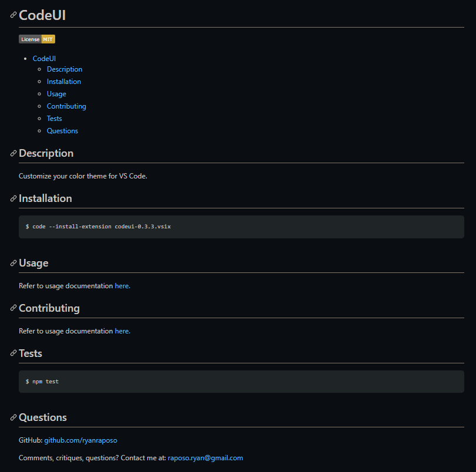

# gendoc

Answer a series of questions to generate a readme.

## Requirements

- Node.js

## Installation

    $ git clone https://github.com/ryanraposo/gendoc
    $ cd gendoc
    $ npm install

## Usage

    $ cd gendoc
    $ node app

## Example

## Walkthrough

https://user-images.githubusercontent.com/38861352/175966756-9acb30e7-e20c-4c84-a8a1-0c508059af4e.mov

